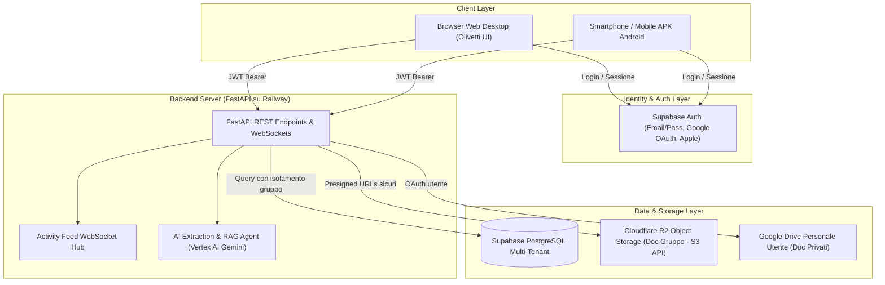
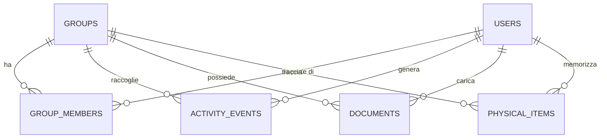

# Specifica Tecnica: Infrastruttura Cloud, Multi-Account & Registro Condiviso di Gruppo
**Progetto:** Dove lo AI messo  
**Data:** 28 Settembre 2026  
**Stato:** Approvato (Draft Architecture Spec)  
**Versione:** 1.0.0  

---

## 1. Visione del Prodotto: Registro Operativo di Gruppo (No Social Chat)

### 1.1 Principio Fondamentale
L'applicazione **NON è e NON deve essere un'alternativa a WhatsApp o un'app di messaggistica generica** per conversazioni informali (saluti, chiacchiere o chat libera tra utenti).

La schermata nei gruppi condivisi opera esclusivamente come un **Registro Meccanico d'Attività e Protocollo Ufficiale Condiviso (Activity & Ledger Feed)**:
* Mostra gli eventi di gestione del caveau generati dai membri (es. *"Marco ha caricato la bolletta Enel Energia di 64,20 €"*, *"Giulia ha contrassegnato come pagato il modello F24"*).
* Mostra la registrazione e lo spostamento di oggetti fisici (es. *"Luca ha memorizzato 'Passaporto' in Studio -> Primo cassetto"*).
* Mostra avvisi automatici di scadenza tributi e bollette emanati dal Caveau a beneficio di tutto il nucleo (es. *"Avviso Caveau: la Tari 2026 scade tra 3 giorni"*).
* Permette ai membri di consultare l'Assistente AI del Caveau ("*Dov'è la chiave del garage?*", "*Quali bollette dobbiamo ancora pagare questo mese?*") con schede protocollo interattive.

---

## 2. Architettura di Sistema Complessiva



### Componenti dell'Infrastruttura:
1. **Server Backend**: FastAPI (Python 3.12+) ospitato su **Railway** (PaaS gestito, deploy continuo da GitHub, Uvicorn asincrono, WebSockets nativi).
2. **Database & Auth**: **Supabase**:
   * **Supabase Auth**: Registrazione, login con Google/Apple, token JWT firmati con chiave asimmetrica, gestione sessioni.
   * **Supabase PostgreSQL**: Database relazionale multi-tenant con Row Level Security (RLS) per isolare rigorosamente i dati tra utenti e gruppi.
3. **Storage Ibrido**:
   * **Documenti Personali**: Locale sul computer / Google Drive privato dell'utente (come nell'attuale versione desktop/mobile).
   * **Documenti Condivisi di Gruppo**: **Cloudflare R2** (compatibile S3, zero costi di trasferimento/egress, presigned URLs temporanei a 15 minuti).
4. **Feed Eventi Real-Time**: WebSocket connection manager in FastAPI per recapitare istantaneamente a tutti i membri connessi le nuove azioni del registro.

---

## 3. Schema Dati Relazionale PostgreSQL



### 3.1 Tabella `users` (Profilo Utente)
Sincronizzata con `auth.users` di Supabase:
* `id` (UUID, Primary Key)
* `email` (VARCHAR, Unique, Not Null)
* `full_name` (VARCHAR, Not Null) - es. "Marco Rossi"
* `avatar_url` (TEXT, Nullable)
* `created_at` (TIMESTAMPTZ, Default NOW())

### 3.2 Tabella `groups` (Nucleo Familiare o Team)
* `id` (UUID, Primary Key)
* `name` (VARCHAR, Not Null) - es. "Famiglia Rossi", "Studio Legale Conti"
* `description` (TEXT, Nullable)
* `icon` (VARCHAR, Default 'fa-house')
* `invite_code` (VARCHAR(12), Unique, Indexed) - Codice univoco di invito (es. `ROX-8821`)
* `created_by` (UUID, Foreign Key `users.id`)
* `created_at` (TIMESTAMPTZ, Default NOW())

### 3.3 Tabella `group_members` (Associazione e Permessi)
* `id` (BIGSERIAL, Primary Key)
* `group_id` (UUID, Foreign Key `groups.id`, Cascade Delete)
* `user_id` (UUID, Foreign Key `users.id`, Cascade Delete)
* `role` (VARCHAR, Default 'member') - Valori: `admin`, `member`, `viewer`
* `joined_at` (TIMESTAMPTZ, Default NOW())
* *Unique Constraint*: `(group_id, user_id)`

### 3.4 Tabella `activity_events` (Il Registro Operativo Ufficiale)
Sostituisce il concetto di chat informale con un **audit log operativo visuale**:
* `id` (BIGSERIAL, Primary Key)
* `group_id` (UUID, Foreign Key `groups.id`, Cascade Delete, Indexed)
* `actor_user_id` (UUID, Nullable, Foreign Key `users.id`) - Chi ha compiuto l'azione (NULL se azione di sistema/AI)
* `actor_name` (VARCHAR, Not Null) - es. "Marco", "Giulia", "Assistente Caveau"
* `event_type` (VARCHAR, Not Null) - Tipologie di evento:
  * `DOCUMENT_UPLOADED`: Inserimento di una nuova bolletta, fattura o contratto.
  * `DOCUMENT_PAID`: Segnatura di un atto come pagato/quietanzato.
  * `DOCUMENT_RENAMED`: Modifica titolo o ri-categorizzazione.
  * `DOCUMENT_DELETED`: Eliminazione di un atto.
  * `ITEM_STORED`: Memorizzazione o spostamento di un oggetto fisico.
  * `DEADLINE_ALERT`: Notifica automatica di scadenza imminente (es. a 7 o 3 giorni).
  * `AI_ASSISTANT_QUERY`: Domanda posta al Caveau da un membro con relativa risposta ufficiale.
* `title` (VARCHAR, Not Null) - Breve sintesi (es. "Nuova Bolletta Enel caricata")
* `content` (TEXT, Nullable) - Testo dettagliato o markdown
* `document_id` (BIGINT, Nullable, Foreign Key `documents.id`)
* `item_id` (BIGINT, Nullable, Foreign Key `physical_items.id`)
* `payload` (JSONB, Nullable) - Dati strutturati (es. importo, data scadenza, fornitore, coordinate posizione)
* `created_at` (TIMESTAMPTZ, Default NOW(), Indexed)

### 3.5 Tabella `documents` (Atti e Fatture Condivise o Personali)
* `id` (BIGSERIAL, Primary Key)
* `user_id` (UUID, Foreign Key `users.id`) - Proprietario/Uploader
* `group_id` (UUID, Nullable, Foreign Key `groups.id`) - NULL = Atto personale; UUID = Atto del gruppo
* `title` (VARCHAR, Not Null)
* `doc_type` (VARCHAR, Default 'generico')
* `issuer` (VARCHAR, Nullable)
* `amount` (NUMERIC(10,2), Nullable)
* `due_date` (DATE, Nullable, Indexed)
* `status` (VARCHAR, Default 'da_pagare') - Valori: `da_pagare`, `quietanzato`, `archiviato`
* `paid_by_user_id` (UUID, Nullable, Foreign Key `users.id`) - Chi ha pagato
* `paid_at` (TIMESTAMPTZ, Nullable)
* `storage_provider` (VARCHAR, Not Null) - `local`, `google_drive`, `r2_storage`
* `storage_path` (VARCHAR, Not Null) - Percorso chiave file
* `summary` (TEXT, Nullable)
* `created_at` (TIMESTAMPTZ, Default NOW())

### 3.6 Tabella `physical_items` (Inventario Fisico)
* `id` (BIGSERIAL, Primary Key)
* `user_id` (UUID, Foreign Key `users.id`)
* `group_id` (UUID, Nullable, Foreign Key `groups.id`)
* `item_name` (VARCHAR, Not Null)
* `primary_location` (VARCHAR, Not Null)
* `detailed_location` (VARCHAR, Nullable)
* `photo_document_id` (BIGINT, Nullable, Foreign Key `documents.id`)
* `updated_by_user_id` (UUID, Nullable, Foreign Key `users.id`)
* `updated_at` (TIMESTAMPTZ, Default NOW())

---

## 4. Esperienza Utente del Registro Operativo

### 4.1 Rendering degli Eventi nel Dattiloscritto Olivetti
Nella schermata del gruppo, non compaiono bolle stile "chat tra amici", ma **voci di protocollo dattiloscritto**:

1. **Evento Inserimento Documento**:
   ```
   [PROTOCOLLO REGISTRO CAVEAU - 28/09/2026 14:32]
   👤 MARCO ha caricato una nuova bolletta:
   📄 Bolletta Enel Energia Bimestre Agosto-Settembre
   💰 Importo: 64,20 € | ⏰ Scadenza: 28/10/2026
   [👁️ Vedi Documento] [⬇️ Scarica] [💳 Segna come Pagato]
   ```

2. **Evento Quietanza / Pagamento**:
   ```
   [QUIETANZA DI SALDO - 29/09/2026 09:15]
   ✅ GIULIA ha saldato la bolletta:
   📄 Bolletta Enel Energia (64,20 €)
   Timbro di stato aggiornato a: QUIETANZATO.
   ```

3. **Evento Posizione Oggetto**:
   ```
   [MEMORIA FISICA - 28/09/2026 18:04]
   📍 LUCA ha registrato: 'Tessera Sanitaria nonno'
   Ambiente: Studio -> Cassettiera centrale
   ```

4. **Interrogazione all'Assistente AI**:
   ```
   👤 MARCO chiede all'assistente: "Quali bollette scadono questa settimana?"
   🤖 ASSISTENTE CAVEAU: "C'è 1 scadenza imminente nel registro di famiglia:
      - 📄 Bolletta A2A (45,00 €) in scadenza dopodomani."
   ```

---

## 5. Storage Ibrido dei File (Cloudflare R2 & Presigned URLs)

### 5.1 Isolamento e Sicurezza
* I file caricati nei gruppi condivisi vengono inviati dal backend FastAPI su un bucket privato **Cloudflare R2**.
* Struttura cartelle nel bucket R2:
  `vault-groups/{group_id}/{category}/{year}/{document_id}_{safe_filename}`
* Nessun file nel bucket è pubblico. Quando un utente del gruppo richiede di visualizzare o scaricare un file:
  1. Il client chiama `GET /api/documents/{id}/presigned-url`.
  2. FastAPI verifica che l'utente autenticato appartenga al `group_id` associato al documento.
  3. Se autorizzato, FastAPI firma crittograficamente un URL temporaneo tramite protocollo S3 con scadenza a **15 minuti**.
  4. Il client accede direttamente allo storage ad altissima velocità senza caricare la banda del server Python.

---

## 6. Real-Time WebSocket Architecture

### 6.1 Endpoint di Connessione
`GET /ws/groups/{group_id}?token=<jwt_supabase>`

* **Handshake**: FastAPI decodifica e verifica il JWT; accerta l'appartenenza dell'utente al gruppo.
* **Canale Broadcast**: Quando un membro esegue un'operazione REST (es. carica documento con `POST /api/documents/upload` o aggiorna lo stato con `PATCH /api/documents/{id}/status`), l'evento viene salvato su database e contemporaneamente inviato a tutti i WebSocket attivi del gruppo.
* **Payload Evento**:
  ```json
  {
    "type": "ACTIVITY_EVENT",
    "event_type": "DOCUMENT_UPLOADED",
    "actor_name": "Marco",
    "actor_id": "9b1deb4d-3b7d-4bad-9bdd-2b0d7b3dcb6d",
    "title": "Bolletta Enel Energia",
    "summary": "Importo 64.20 € - Scadenza 28/10/2026",
    "document": {
      "id": 142,
      "title": "Bolletta Enel Energia",
      "amount": 64.20,
      "due_date": "2026-10-28",
      "status": "da_pagare"
    },
    "created_at": "2026-09-28T21:34:00Z"
  }
  ```

---

## 7. Strategia di Deployment su Railway (PaaS)

### 7.1 Containerizzazione Docker
* Immagine base: `python:3.12-slim`
* Avvio server: `uvicorn app.main:app --host 0.0.0.0 --port $PORT --workers 2`

### 7.2 Variabili di Configurazione (Railway Environment)
| Variabile | Descrizione |
| :--- | :--- |
| `DATABASE_URL` | URI di connessione PostgreSQL fornito da Supabase |
| `SUPABASE_URL` | URL del progetto Supabase (es. `https://xyz.supabase.co`) |
| `SUPABASE_JWT_SECRET` | Chiave di verifica crittografica dei token JWT utente |
| `R2_ACCOUNT_ID` | Cloudflare Account ID per Object Storage |
| `R2_ACCESS_KEY_ID` | Chiave di accesso S3 Cloudflare R2 |
| `R2_SECRET_ACCESS_KEY` | Chiave segreta S3 Cloudflare R2 |
| `R2_BUCKET_NAME` | Nome bucket R2 (es. `dove-lo-ai-messo-prod`) |
| `GEMINI_API_KEY` | Chiave API Vertex AI / Gemini per analisi documenti e chat |
| `STORAGE_MODE` | `hybrid` (Locale/Drive per personale, R2 per gruppi) |

---

## 8. Piano di Rilascio Incrementale

1. **Fase 1: Schema DB & Script di Migrazione Alembic**:
   Creazione tabelle `groups`, `group_members`, `activity_events` e predisposizione campi `group_id` su documenti e oggetti.
2. **Fase 2: Integrazione Supabase Auth Middleware**:
   Dipendenza di autenticazione `get_current_user` in FastAPI per validare i token JWT delle richieste.
3. **Fase 3: Cloudflare R2 Client Service**:
   Modulo `r2_service.py` per upload crittografato e generazione di presigned URLs temporanei per i file di gruppo.
4. **Fase 4: Activity Feed & WebSocket Dispatcher**:
   Implementazione del connection manager WebSocket per il broadcast delle notifiche di inserimento e pagamento.
5. **Fase 5: UI Olivetti per i Gruppi**:
   Visualizzazione del feed del registro di gruppo con timbri ufficiali, codice di invito e schede protocollo per le azioni dei membri.
